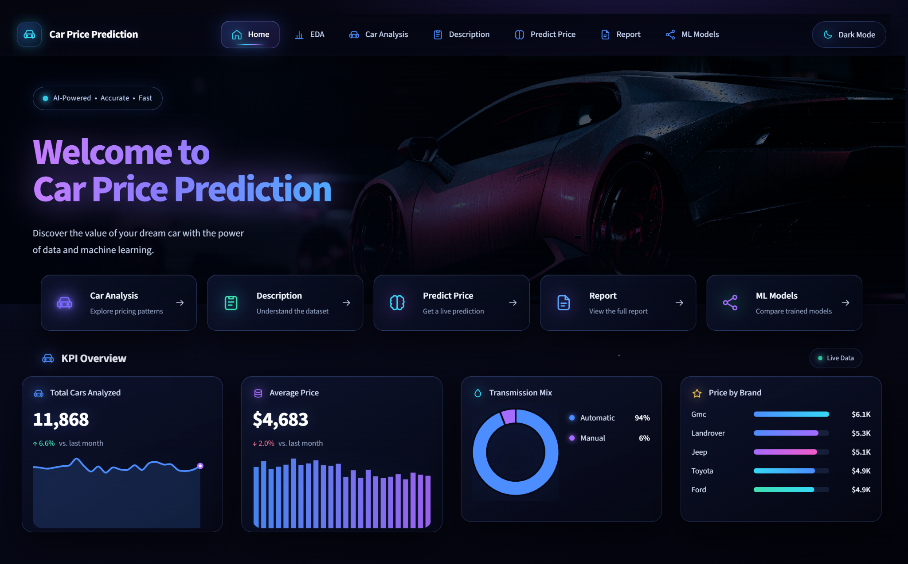

# 🚗 Smart Car Price Prediction



<p align="center">
  <strong>Machine Learning Dashboard for Car Price Prediction</strong>
</p>

<p align="center">
  An interactive Streamlit application for car data analysis, machine learning model comparison, and car price prediction.
</p>

---

## 📌 Overview

**Smart Car Price Prediction** is an interactive machine learning dashboard built with **Python** and **Streamlit**.

The project combines **data analysis, interactive visualization, machine learning model comparison, and car price prediction** into one simple and user-friendly application.

### 🌐 Live Demo

🚀 **https://smart-car-pricing.streamlit.app/**

---

## ✨ Features

- 📊 Interactive KPI dashboard
- 🚘 Car market analysis
- 📋 Dataset exploration and statistical description
- 🤖 Machine learning model comparison
- 💰 Interactive car price prediction
- 📈 Model performance evaluation
- 📑 Automated project report generation
- 🎨 Interactive and responsive Streamlit interface

---

## 🖥️ Dashboard Pages

| Page | Description |
|------|-------------|
| 📊 **KPI Overview** | View key statistics and important market insights |
| 🚘 **Car Analysis** | Analyze car prices, brands, and vehicle characteristics |
| 📋 **Data Description** | Explore the dataset structure and statistical information |
| 🤖 **ML Models** | Compare different machine learning models and their performance |
| 💰 **Predict Price** | Predict a car's price based on its specifications |
| 📑 **Report** | Generate and download an automated project report |

---

## 🤖 Machine Learning Models

The project uses several regression algorithms for car price prediction:

- **XGBoost**
- **LightGBM**
- **Random Forest**
- **Decision Tree**
- **Linear Regression**

### 📈 Model Performance

| Model | Train R² | Train MAE | Train RMSE | Test R² | Test MAE | Test RMSE |
|------|---------:|----------:|-----------:|--------:|---------:|----------:|
| **XGBoost** | 0.934811 | 0.148137 | 0.232283 | 0.928308 | 0.152985 | 0.242901 |
| **LightGBM** | 0.928567 | 0.153774 | 0.243153 | 0.925363 | 0.156129 | 0.247838 |
| **Random Forest** | 0.899148 | 0.192364 | 0.288916 | 0.884367 | 0.202831 | 0.308485 |
| **Decision Tree** | 0.912052 | 0.166113 | 0.269800 | 0.879025 | 0.192294 | 0.315529 |
| **Linear Regression** | 0.802038 | 0.288921 | 0.404781 | 0.799452 | 0.289783 | 0.406258 |

---

## 🛠️ Tech Stack

### 💻 Programming Language

- Python

### 🧠 Data Science & Machine Learning

- Pandas
- NumPy
- Scikit-learn
- XGBoost
- LightGBM

### 📊 Visualization

- Plotly

### 🌐 Application

- Streamlit

### 📑 Reporting

- FPDF

---

## 📂 Project Structure

```text
car-price-prediction/
│
├── assets/
│   └── readme_home.png
│
├── data/
│   └── .gitkeep
│
├── data_prep/
│   ├── __init__.py
│   ├── clean_pipeline.py
│   ├── generate_synthetic_data.py
│   └── train_models.py
│
├── docs/
│   └── screenshots/
│       └── home_preview.png
│
├── models/
│   └── .gitkeep
│
├── pages/
│   ├── 1_KPI_Overview.py
│   ├── 2_Car_Analysis.py
│   ├── 3_Data_Description.py
│   ├── 4_ML_Models.py
│   ├── 5_Predict_Price.py
│   └── 6_Report.py
│
├── utils/
│   ├── __init__.py
│   ├── charts.py
│   ├── data_loader.py
│   ├── inference.py
│   ├── ml_utils.py
│   └── theme.py
│
├── Home.py
├── README.md
└── requirements.txt
```

## 👨‍💻 Author

### Abdelaziz Elshourbgy

- 🐙 GitHub: [AbdelazizElshourbgy-ui](https://github.com/AbdelazizElshourbgy-ui)
- 💼 LinkedIn: [abdelaziz-elshourbgy](https://www.linkedin.com/in/abdelaziz-elshourbgy-b126a83a2/)
